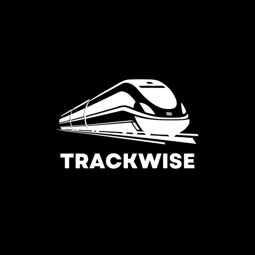

[![LinkedIn][linkedin-shield]][linkedin-url]
 

    
  </a>

  <h3 align="center">Trackwise</h3>

  

    Train ticket booking with the train tracking app.
     
     
    <a href="https://youtube.com/shorts/8JWz_cZqEHM" style="text-decoration=none">View Demo</a>
  

### About this project

    
  </a>

 
  This app comes with train ticket booking and train live location tracking. The app will communicate with the database using REST API and Websocket will be used to track the live location of the train.

### Used programming languages

  <ul>
    <li> JavaScript</li>
    <li> Dart</li>
  </ul>
  

[linkedin-shield]: https://img.shields.io/badge/-LinkedIn-black.svg?style=for-the-badge&logo=linkedin&colorB=555
[linkedin-url]: https://www.linkedin.com/in/im-pasindu-harshana
